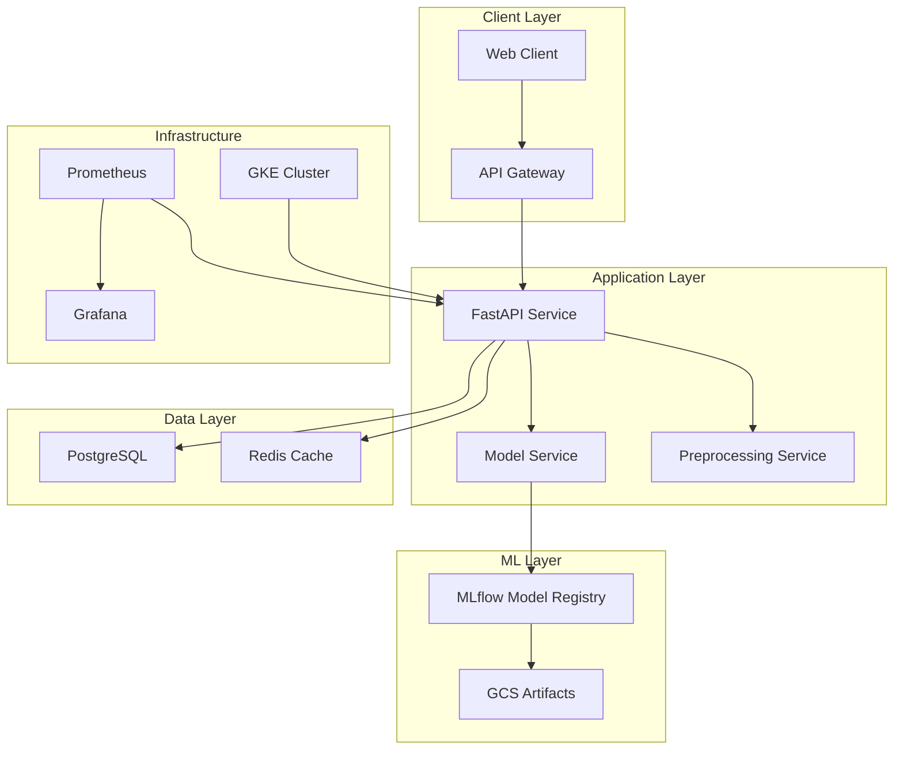

# Credit Card Approval Prediction - Documentation

> A production-ready MLOps pipeline for credit card approval prediction using machine learning.

## 🏗️ Architecture Overview



---

## 📚 Documentation Structure

### 🚀 Getting Started
| Document | Description |
|----------|-------------|
| [Quick Start](./getting-started/quick-start.md) | 5-minute setup guide |
| [Installation](./getting-started/installation.md) | Prerequisites & dependencies |
| [Local Development](./getting-started/local-development.md) | Docker-compose setup |

### 📦 Modules
| Module | Overview | Key Topics |
|--------|----------|------------|
| [API](./modules/api/overview.md) | FastAPI application | [Endpoints](./modules/api/endpoints.md) • [Configuration](./modules/api/configuration.md) |
| [ML Pipeline](./modules/ml-pipeline/overview.md) | Training & inference | [Data Prep](./modules/ml-pipeline/data-preparation.md) • [Training](./modules/ml-pipeline/model-training.md) |
| [Infrastructure](./modules/infrastructure/overview.md) | Terraform & GCP | [Setup](./modules/infrastructure/terraform-setup.md) • [Costs](./modules/infrastructure/cost-management.md) |
| [Kubernetes](./modules/kubernetes/overview.md) | Helm deployments | [Charts](./modules/kubernetes/helm-charts.md) • [Deployment](./modules/kubernetes/deployment-guide.md) |
| [CI/CD](./modules/cicd/overview.md) | Jenkins pipeline | [Pipeline](./modules/cicd/jenkins-pipeline.md) • [SonarQube](./modules/cicd/sonarqube-setup.md) |
| [Monitoring](./modules/monitoring/overview.md) | Observability stack | [Prometheus](./modules/monitoring/prometheus-setup.md) • [Grafana](./modules/monitoring/grafana-dashboards.md) |

### 🔧 Operations
| Document | Description |
|----------|-------------|
| [Deployment Checklist](./operations/deployment-checklist.md) | Pre/post deployment steps |
| [Runbook](./operations/runbook.md) | Operational procedures |
| [Disaster Recovery](./operations/disaster-recovery.md) | Recovery procedures |

### 📖 Reference
| Document | Description |
|----------|-------------|
| [API Reference](./reference/api-reference.md) | Full API specification |
| [Environment Variables](./reference/environment-variables.md) | All configuration options |
| [Architecture Diagrams](./reference/architecture-diagrams.md) | System diagrams |
| [Glossary](./reference/glossary.md) | Terms & definitions |

---

## ⚡ Quick Start

```bash
# 1. Clone and setup
git clone https://github.com/your-org/card-approval-prediction.git
cd card-approval-prediction
pip install -r requirements.txt

# 2. Start local services
docker-compose up -d

# 3. Run API
uvicorn app.main:app --reload --host 0.0.0.0 --port 8000

# 4. Access services
open http://localhost:8000/docs    # API Documentation
open http://localhost:5000         # MLflow UI
```

---

## 🗂️ Project Structure

```
card-approval-prediction/
├── app/                    # FastAPI application
├── cap_model/              # ML training pipeline
├── helm-charts/            # Kubernetes deployments
├── terraform/              # Infrastructure as Code
├── scripts/                # Utility scripts
├── tests/                  # Test suites
├── ansible/                # Configuration management
└── docs/                   # This documentation
```

---

## 📞 Support

- **Issues**: [GitHub Issues](https://github.com/your-org/card-approval-prediction/issues)
- **Discussions**: [GitHub Discussions](https://github.com/your-org/card-approval-prediction/discussions)
