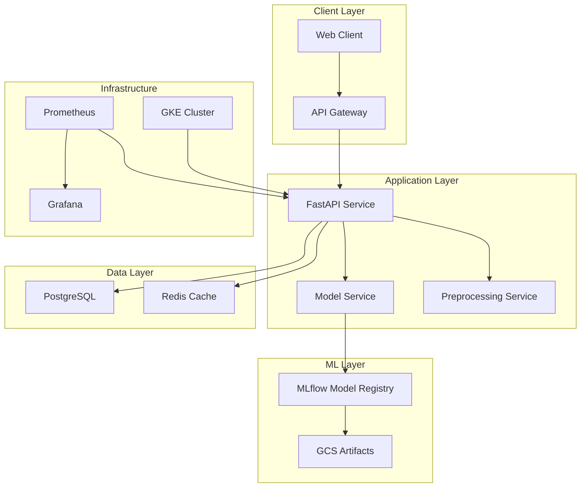

# Credit Card Approval Prediction - Documentation

> A production-ready MLOps pipeline for credit card approval prediction using machine learning.

## 🏗️ Architecture Overview



---

## 📚 Documentation

| # | Document | Description |
|---|----------|-------------|
| 00 | [**Setup Guide**](./00_Setup_Guide.md) | ⚙️ **Start here!** Configuration & setup |
| 01 | [Terraform Setup](./01_Terraform.md) | GCP infrastructure setup |
| 02 | [Terraform Architecture](./02_terraform_architecture.md) | Infrastructure design |
| 03 | [Helm Deployment](./03_Helm_Deployment.md) | Kubernetes deployment |
| 04 | [MLflow & Training](./04_MLflow_Training.md) | Model training pipeline |
| 05 | [API Service](./05_API_Service.md) | FastAPI application |
| 06 | [CI/CD Pipeline](./06_CICD_Pipeline.md) | Jenkins automation |
| 07 | [Monitoring](./07_Monitoring.md) | Prometheus + Grafana |

---

## ⚡ Quick Start

```bash
# 1. Clone and setup
git clone https://github.com/your-org/card-approval-prediction.git
cd card-approval-prediction

# 2. Configure your environment (see Setup Guide for details)
cp config.example.env config.env
# Edit config.env with your GCP project ID and passwords

# 3. Install dependencies
pip install -r requirements.txt

# 4. Start local services
docker-compose up -d

# 5. Run API locally
uvicorn app.main:app --reload --host 0.0.0.0 --port 8000

# 6. Access services
open http://localhost:8000/docs    # API Documentation
open http://localhost:5000         # MLflow UI
```

> 📖 **For full deployment instructions**, see the [Setup Guide](./00_Setup_Guide.md)

---

## 🗂️ Project Structure

```
card-approval-prediction/
├── app/                    # FastAPI application
├── cap_model/              # ML training pipeline
├── helm-charts/            # Kubernetes deployments
├── terraform/              # Infrastructure as Code
├── scripts/                # Utility scripts
├── tests/                  # Test suites
├── ansible/                # Configuration management
└── docs/                   # This documentation
```

---

## 📞 Support

- **Issues**: [GitHub Issues](https://github.com/your-org/card-approval-prediction/issues)
- **Discussions**: [GitHub Discussions](https://github.com/your-org/card-approval-prediction/discussions)
